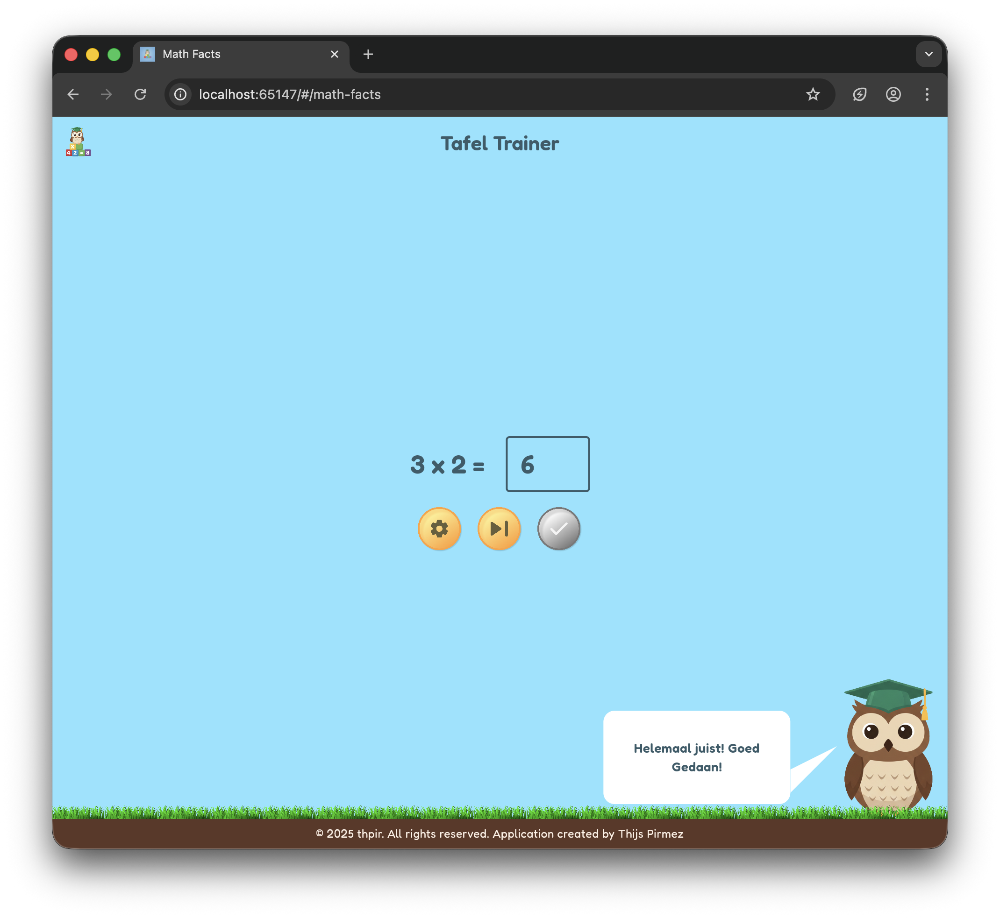

# Math facts (Tafel trainer)

Math facts practice app.



## Data Model

The JSON in `assets/math_facts.json` is parsed into Dart models:

- `MathFact` represents a single multiplication or division fact.
- `TableFacts` groups facts for a specific table number.
- `MathFactsData` is the root containing all tables plus metadata.

Load and use with the repository:

```dart
final repo = const MathFactsRepository();
final data = await repo.load();
final random = await repo.randomExercise(operation: MathOperation.multiplication);
print(random.expression); // e.g. "7 x 8"
```

## Quick Start

```bash
flutter pub get
flutter run -d chrome
```

## Asset

Ensure the asset is declared in `pubspec.yaml` under `flutter.assets` (already added).

